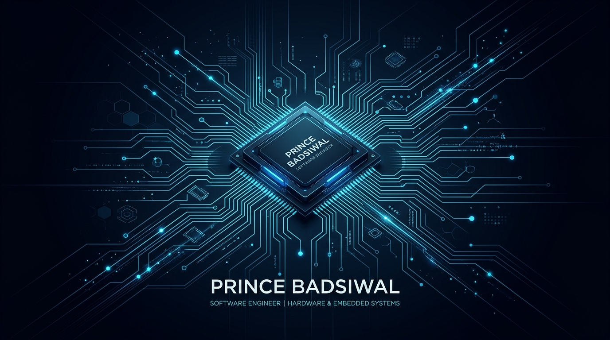

# Prince Badsiwal

### **Hardware-Savvy Developer & Systems Engineer**
*Building practical automation, on-device intelligence, and reliable software for real devices.*

---

## 📌 Executive Summary

I develop privacy-preserving, device-aware software — spanning on-device LLM inference on consumer Android hardware to resilient automation tools and applied AI workflows.

* 📱 **Edge & On-Device AI:** Developing local, offline LLM runtimes on Android using Google AI Edge LiteRT, Vulkan GPU acceleration, and camera OCR.
* 🛡️ **AI Safety & Retrieval:** Designing hybrid semantic pipelines (BM25 + dense vector embeddings) with prompt-injection defense layers and bias auditing.
* ⚡ **Systems & Automation:** Engineering resilient stream archiving tools with exponential backoff and deterministic, reversible filesystem utilities.

---

## 🚀 Selected Projects

> 🌟 **Start here:** **[`Local-LLM-AI`](https://github.com/PrinceBad/Local-LLM-AI)** — Flagship Android application exploring offline language-model execution and multimodal OCR directly on real mobile hardware.

| Domain | Project | Core Stack | What It Demonstrates |
| :--- | :--- | :--- | :--- |
| **Edge AI & Mobile** | **[`Local-LLM-AI`](https://github.com/PrinceBad/Local-LLM-AI)** | Kotlin · Compose · LiteRT · Vulkan | Offline Android LLM and OCR workflows with a focus on device-aware performance and zero cloud dependence. |
| **Enterprise AI & NLP** | **[`APEX-ATS`](https://github.com/PrinceBad/APEX-ATS)** | Python · BM25 · Embeddings · React | Resume-ranking workflow combining lexical search, semantic retrieval, and prompt-injection screening safeguards. |
| **Media Engineering** | **[`PyStream-Downloader`](https://github.com/PrinceBad/PyStream-Downloader)** | Python · Async I/O · HLS/DASH | Resilient tooling for authorized stream capture, automatic retries, and live progress reporting. |
| **Lecture to Docs** | **[`TubeNotes`](https://github.com/PrinceBad/TubeNotes)** | React 19 · Vite · Express · jsPDF | Compiles lecture and educational media into clean, searchable, vector-crisp study guide PDFs. |
| **Filesystem Tooling** | **[`PyFile-Organizer`](https://github.com/PrinceBad/PyFile-Organizer)** | Python · CLI · JSON | Safer directory organization with non-destructive preview mode and recorded undo manifests. |
| **Document Processing** | **[`Py-Image-Compressor`](https://github.com/PrinceBad/Py-Image-Compressor)** | Python · Pillow · Desktop GUI | Batch image compression and format conversion with practical visual quality controls. |
| **Document Generation** | **[`Image-2-Pdf-Demo`](https://github.com/PrinceBad/Image-2-Pdf-Demo)** | Python · PyMuPDF · PIL | Multi-format image synthesis into structured, multi-page PDF documents. |
| **Generative AI** | **[`Anime-Recommender`](https://github.com/PrinceBad/Anime-Recommender)** | Python · Gemini API | Prompt-assisted content discovery and recommendation engine utilizing Google Gemini. |

---

## 🛠️ Technical Arsenal

**AI & Edge Runtime**  

**Languages**  

**Engineering & Frameworks**  

---

## 📈 Engineering Principles

1. **Privacy by Architecture:** Keeping sensitive processing on-device can reduce exposure to third-party services and network transit. I design local-first workflows with clear data handling and user control.
2. **Security & Robustness:** I evaluate AI-assisted workflows against prompt injection, malformed input, unsafe output handling, and failure conditions before relying on them in production-like workflows.
3. **Safe, Reversible Automation:** File-system tools should provide clear previews, explicit apply steps, operation logs, and rollback support wherever possible.

---

## 🐍 Contribution Signal

<picture>
  <source media="(prefers-color-scheme: dark)" srcset="https://raw.githubusercontent.com/PrinceBad/PrinceBad/output/github-contribution-grid-snake-dark.svg" />
  <source media="(prefers-color-scheme: light)" srcset="https://raw.githubusercontent.com/PrinceBad/PrinceBad/output/github-contribution-grid-snake.svg" />
  
</picture>

---

## 💬 Collaborate

* 🔭 **Currently Exploring:** Mobile performance profiling, on-device LLM quantization on diverse silicon (Snapdragon / Tensor / Dimensity), and adversarial evaluation of LLM pipelines.
* 🌐 **Live Website & Portfolio:** [badsiwal.my-style.in](https://badsiwal.my-style.in/)
* 💼 **LinkedIn:** [linkedin.com/in/prince-badsiwal](https://linkedin.com/in/prince-badsiwal)
* 🐙 **GitHub:** [github.com/PrinceBad](https://github.com/PrinceBad)
* 🤝 **Open To:** On-Device AI, Android, Python systems, developer tooling, and open-source collaboration.

Built with care • Focused on useful, reliable software

