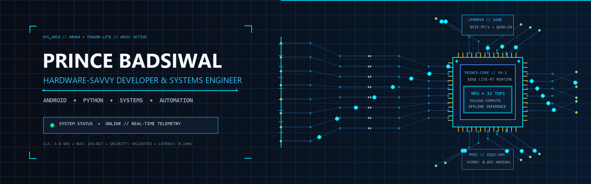

<picture>
  <source
    media="(prefers-reduced-motion: reduce)"
    srcset="./assets/hardware-signal-static.jpg"
  />
  
</picture>

 

`SYSTEM STATUS  ▸  ANDROID • PYTHON • AUTOMATION • ACTIVE`

  

---

## [01] ABOUT

I build privacy-conscious, hardware-aware software across Android, Python automation, applied AI, and document workflows.

* 📱 **Mobile & Edge Systems:** Android applications using Kotlin, Jetpack Compose, LiteRT, Vulkan, and camera OCR.
* 🛡️ **Applied AI & NLP:** Retrieval workflows using BM25, vector embeddings, structured evaluation, and defensive input handling.
* ⚙️ **Reliable Automation:** Resilient media tools and reversible filesystem utilities designed for real-world failure conditions.

---

## [02] FEATURED SYSTEMS

> 🌟 **Start here:** **[`Local-LLM-AI`](https://github.com/PrinceBad/Local-LLM-AI)**  
> My flagship Android project for exploring offline language-model execution, camera OCR, and performance on real mobile hardware.

| Project | Focus | Stack |
| :--- | :--- | :--- |
| **[`Local-LLM-AI`](https://github.com/PrinceBad/Local-LLM-AI)** | Offline Android LLM and OCR workflows designed for reduced cloud dependence | Kotlin · Compose · LiteRT · Vulkan |
| **[`APEX-ATS`](https://github.com/PrinceBad/APEX-ATS)** | Hybrid resume retrieval and screening safeguards | Python · BM25 · Embeddings · React |
| **[`PyStream-Downloader`](https://github.com/PrinceBad/PyStream-Downloader)** | Resilient authorized stream capture | Python · Async I/O · HLS/DASH |

### 🧰 More Projects

* **[`TubeNotes`](https://github.com/PrinceBad/TubeNotes)** — Converts educational media into searchable, vector-crisp study-guide PDFs.
* **[`PyFile-Organizer`](https://github.com/PrinceBad/PyFile-Organizer)** — Safe directory organization with non-destructive preview and undo manifests.
* **[`Py-Image-Compressor`](https://github.com/PrinceBad/Py-Image-Compressor)** — Batch image compression and format conversion with practical quality controls.
* **[`Image-2-Pdf-Demo`](https://github.com/PrinceBad/Image-2-Pdf-Demo)** — Multi-image PDF generation for clean document workflows.
* **[`Anime-Recommender`](https://github.com/PrinceBad/Anime-Recommender)** — Gemini-powered recommendation workflow and content matching.

---

## [03] ENGINEERING SNAPSHOT

| Focus | Demonstrated Techniques & Capabilities |
| :--- | :--- |
| **Mobile Performance** | LiteRT runtime integration, Vulkan GPU acceleration, Android hardware profiling |
| **AI Reliability** | Prompt-injection testing, malformed-input sanitization, structured evaluation workflows |
| **Automation Safety** | Dry-run preview modes, operation logs, JSON rollback manifests |
| **Document Workflows** | Camera OCR pipelines, image preprocessing, quality-aware compression, and PDF generation |
| **Resilient Systems** | Non-blocking async I/O, exponential backoff retries, progress tracking, and failure recovery |

---

## [04] TECHNICAL ARSENAL

**AI & Edge Runtime**  

**Languages**  

**Engineering & Frameworks**  

**Systems & Applied Techniques**  
`Vulkan` · `BM25` · `Vector Retrieval` · `HLS/DASH` · `Async I/O` · `OCR Pipelines` · `PDF Generation`

---

## [05] ENGINEERING PRINCIPLES

1. **Privacy by Architecture:** Keep sensitive processing local where practical, minimize unnecessary data transfer, and make data handling explicit.
2. **Security & Robustness:** Test AI-assisted workflows against prompt injection, malformed inputs, unsafe outputs, and predictable failure modes.
3. **Safe, Reversible Automation:** Prefer previews, explicit apply steps, operation logs, and recovery paths for tools that modify user files.

---

## [06] CONTRIBUTION SIGNAL

<picture>
  <source media="(prefers-color-scheme: dark)" srcset="https://raw.githubusercontent.com/PrinceBad/PrinceBad/output/github-contribution-grid-snake-dark.svg" />
  <source media="(prefers-color-scheme: light)" srcset="https://raw.githubusercontent.com/PrinceBad/PrinceBad/output/github-contribution-grid-snake.svg" />
  
</picture>

---

## [07] COLLABORATE

* 🔭 **Currently Exploring:** Mobile performance profiling, model quantization, and robust evaluation of AI-assisted workflows.
* 🤝 **Open To:** Android, Python systems, applied NLP, developer tooling, and open-source collaboration.
* 🌐 **Portfolio:** [badsiwal.my-style.in](https://badsiwal.my-style.in/)
* 💼 **LinkedIn:** [Connect with me](https://linkedin.com/in/prince-badsiwal)

Built with care • Focused on useful, reliable software

